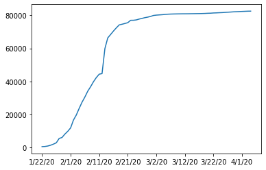
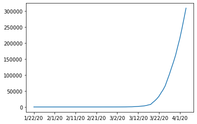
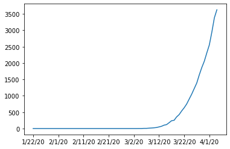
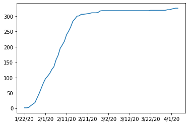

# covid19 spread analysis
Coronavirus spread analysis in Python, Jupyter and pandas

Contact: Robert Nowotniak <rnowotniak@gmail.com>

**Last updated:  Apr 5th, 2020**


----


* https://raw.githubusercontent.com/CSSEGISandData/COVID-19/master/csse_covid_19_data/csse_covid_19_time_series/time_series_covid19_confirmed_global.csv


* docker pull jupyter/scipy-notebook
* docker run -p 8888:8888 -v "$PWD:/home/jovyan/work"   --rm jupyter/scipy-notebook

* Data source: https://github.com/CSSEGISandData/COVID-19
* Docker image: jupyter/minimal-notebook


```python
import pandas as pd, numpy as np
```

Data from John Hopkin University:


```python
DATA_URL='https://raw.githubusercontent.com/CSSEGISandData/COVID-19/master/csse_covid_19_data/csse_covid_19_time_series/time_series_covid19_confirmed_global.csv'
```


```python
data=pd.read_csv(DATA_URL)
```


```python
data.head()
```


<div>
<style scoped>
    .dataframe tbody tr th:only-of-type {
        vertical-align: middle;
    }

    .dataframe tbody tr th {
        vertical-align: top;
    }

    .dataframe thead th {
        text-align: right;
    }
</style>
<table border="1" class="dataframe">
  <thead>
    <tr style="text-align: right;">
      <th></th>
      <th>Province/State</th>
      <th>Country/Region</th>
      <th>Lat</th>
      <th>Long</th>
      <th>1/22/20</th>
      <th>1/23/20</th>
      <th>1/24/20</th>
      <th>1/25/20</th>
      <th>1/26/20</th>
      <th>1/27/20</th>
      <th>...</th>
      <th>3/26/20</th>
      <th>3/27/20</th>
      <th>3/28/20</th>
      <th>3/29/20</th>
      <th>3/30/20</th>
      <th>3/31/20</th>
      <th>4/1/20</th>
      <th>4/2/20</th>
      <th>4/3/20</th>
      <th>4/4/20</th>
    </tr>
  </thead>
  <tbody>
    <tr>
      <th>0</th>
      <td>NaN</td>
      <td>Afghanistan</td>
      <td>33.0000</td>
      <td>65.0000</td>
      <td>0</td>
      <td>0</td>
      <td>0</td>
      <td>0</td>
      <td>0</td>
      <td>0</td>
      <td>...</td>
      <td>94</td>
      <td>110</td>
      <td>110</td>
      <td>120</td>
      <td>170</td>
      <td>174</td>
      <td>237</td>
      <td>273</td>
      <td>281</td>
      <td>299</td>
    </tr>
    <tr>
      <th>1</th>
      <td>NaN</td>
      <td>Albania</td>
      <td>41.1533</td>
      <td>20.1683</td>
      <td>0</td>
      <td>0</td>
      <td>0</td>
      <td>0</td>
      <td>0</td>
      <td>0</td>
      <td>...</td>
      <td>174</td>
      <td>186</td>
      <td>197</td>
      <td>212</td>
      <td>223</td>
      <td>243</td>
      <td>259</td>
      <td>277</td>
      <td>304</td>
      <td>333</td>
    </tr>
    <tr>
      <th>2</th>
      <td>NaN</td>
      <td>Algeria</td>
      <td>28.0339</td>
      <td>1.6596</td>
      <td>0</td>
      <td>0</td>
      <td>0</td>
      <td>0</td>
      <td>0</td>
      <td>0</td>
      <td>...</td>
      <td>367</td>
      <td>409</td>
      <td>454</td>
      <td>511</td>
      <td>584</td>
      <td>716</td>
      <td>847</td>
      <td>986</td>
      <td>1171</td>
      <td>1251</td>
    </tr>
    <tr>
      <th>3</th>
      <td>NaN</td>
      <td>Andorra</td>
      <td>42.5063</td>
      <td>1.5218</td>
      <td>0</td>
      <td>0</td>
      <td>0</td>
      <td>0</td>
      <td>0</td>
      <td>0</td>
      <td>...</td>
      <td>224</td>
      <td>267</td>
      <td>308</td>
      <td>334</td>
      <td>370</td>
      <td>376</td>
      <td>390</td>
      <td>428</td>
      <td>439</td>
      <td>466</td>
    </tr>
    <tr>
      <th>4</th>
      <td>NaN</td>
      <td>Angola</td>
      <td>-11.2027</td>
      <td>17.8739</td>
      <td>0</td>
      <td>0</td>
      <td>0</td>
      <td>0</td>
      <td>0</td>
      <td>0</td>
      <td>...</td>
      <td>4</td>
      <td>4</td>
      <td>5</td>
      <td>7</td>
      <td>7</td>
      <td>7</td>
      <td>8</td>
      <td>8</td>
      <td>8</td>
      <td>10</td>
    </tr>
  </tbody>
</table>
<p>5 rows × 78 columns</p>
</div>


Discard Province/State information


```python
data.groupby(by='Country/Region').sum().transpose()['China'][2:].plot()
```


    <matplotlib.axes._subplots.AxesSubplot at 0x7fb998025b10>





```python
data.groupby(by='Country/Region').sum().transpose()['US'][2:].plot()
```


    <matplotlib.axes._subplots.AxesSubplot at 0x7fb997f4f510>





```python
data.groupby(by='Country/Region').sum().transpose()['China'][2:].plot()
```


    <matplotlib.axes._subplots.AxesSubplot at 0x7fb998025b10>


```python
data.set_index(['Country/Region','Province/State']).transpose()['Poland',np.nan][2:].plot()
```


    <matplotlib.axes._subplots.AxesSubplot at 0x7fb9982a4a50>





```python
data.set_index(['Country/Region','Province/State']).transpose()['China']
```


<div>
<style scoped>
    .dataframe tbody tr th:only-of-type {
        vertical-align: middle;
    }

    .dataframe tbody tr th {
        vertical-align: top;
    }

    .dataframe thead th {
        text-align: right;
    }
</style>
<table border="1" class="dataframe">
  <thead>
    <tr style="text-align: right;">
      <th>Province/State</th>
      <th>Anhui</th>
      <th>Beijing</th>
      <th>Chongqing</th>
      <th>Fujian</th>
      <th>Gansu</th>
      <th>Guangdong</th>
      <th>Guangxi</th>
      <th>Guizhou</th>
      <th>Hainan</th>
      <th>Hebei</th>
      <th>...</th>
      <th>Shaanxi</th>
      <th>Shandong</th>
      <th>Shanghai</th>
      <th>Shanxi</th>
      <th>Sichuan</th>
      <th>Tianjin</th>
      <th>Tibet</th>
      <th>Xinjiang</th>
      <th>Yunnan</th>
      <th>Zhejiang</th>
    </tr>
  </thead>
  <tbody>
    <tr>
      <th>Lat</th>
      <td>31.8257</td>
      <td>40.1824</td>
      <td>30.0572</td>
      <td>26.0789</td>
      <td>37.8099</td>
      <td>23.3417</td>
      <td>23.8298</td>
      <td>26.8154</td>
      <td>19.1959</td>
      <td>39.5490</td>
      <td>...</td>
      <td>35.1917</td>
      <td>36.3427</td>
      <td>31.2020</td>
      <td>37.5777</td>
      <td>30.6171</td>
      <td>39.3054</td>
      <td>31.6927</td>
      <td>41.1129</td>
      <td>24.974</td>
      <td>29.1832</td>
    </tr>
    <tr>
      <th>Long</th>
      <td>117.2264</td>
      <td>116.4142</td>
      <td>107.8740</td>
      <td>117.9874</td>
      <td>101.0583</td>
      <td>113.4244</td>
      <td>108.7881</td>
      <td>106.8748</td>
      <td>109.7453</td>
      <td>116.1306</td>
      <td>...</td>
      <td>108.8701</td>
      <td>118.1498</td>
      <td>121.4491</td>
      <td>112.2922</td>
      <td>102.7103</td>
      <td>117.3230</td>
      <td>88.0924</td>
      <td>85.2401</td>
      <td>101.487</td>
      <td>120.0934</td>
    </tr>
    <tr>
      <th>1/22/20</th>
      <td>1.0000</td>
      <td>14.0000</td>
      <td>6.0000</td>
      <td>1.0000</td>
      <td>0.0000</td>
      <td>26.0000</td>
      <td>2.0000</td>
      <td>1.0000</td>
      <td>4.0000</td>
      <td>1.0000</td>
      <td>...</td>
      <td>0.0000</td>
      <td>2.0000</td>
      <td>9.0000</td>
      <td>1.0000</td>
      <td>5.0000</td>
      <td>4.0000</td>
      <td>0.0000</td>
      <td>0.0000</td>
      <td>1.000</td>
      <td>10.0000</td>
    </tr>
    <tr>
      <th>1/23/20</th>
      <td>9.0000</td>
      <td>22.0000</td>
      <td>9.0000</td>
      <td>5.0000</td>
      <td>2.0000</td>
      <td>32.0000</td>
      <td>5.0000</td>
      <td>3.0000</td>
      <td>5.0000</td>
      <td>1.0000</td>
      <td>...</td>
      <td>3.0000</td>
      <td>6.0000</td>
      <td>16.0000</td>
      <td>1.0000</td>
      <td>8.0000</td>
      <td>4.0000</td>
      <td>0.0000</td>
      <td>2.0000</td>
      <td>2.000</td>
      <td>27.0000</td>
    </tr>
    <tr>
      <th>1/24/20</th>
      <td>15.0000</td>
      <td>36.0000</td>
      <td>27.0000</td>
      <td>10.0000</td>
      <td>2.0000</td>
      <td>53.0000</td>
      <td>23.0000</td>
      <td>3.0000</td>
      <td>8.0000</td>
      <td>2.0000</td>
      <td>...</td>
      <td>5.0000</td>
      <td>15.0000</td>
      <td>20.0000</td>
      <td>1.0000</td>
      <td>15.0000</td>
      <td>8.0000</td>
      <td>0.0000</td>
      <td>2.0000</td>
      <td>5.000</td>
      <td>43.0000</td>
    </tr>
    <tr>
      <th>...</th>
      <td>...</td>
      <td>...</td>
      <td>...</td>
      <td>...</td>
      <td>...</td>
      <td>...</td>
      <td>...</td>
      <td>...</td>
      <td>...</td>
      <td>...</td>
      <td>...</td>
      <td>...</td>
      <td>...</td>
      <td>...</td>
      <td>...</td>
      <td>...</td>
      <td>...</td>
      <td>...</td>
      <td>...</td>
      <td>...</td>
      <td>...</td>
    </tr>
    <tr>
      <th>3/31/20</th>
      <td>990.0000</td>
      <td>580.0000</td>
      <td>579.0000</td>
      <td>343.0000</td>
      <td>138.0000</td>
      <td>1494.0000</td>
      <td>254.0000</td>
      <td>146.0000</td>
      <td>168.0000</td>
      <td>321.0000</td>
      <td>...</td>
      <td>253.0000</td>
      <td>774.0000</td>
      <td>509.0000</td>
      <td>136.0000</td>
      <td>550.0000</td>
      <td>174.0000</td>
      <td>1.0000</td>
      <td>76.0000</td>
      <td>182.000</td>
      <td>1257.0000</td>
    </tr>
    <tr>
      <th>4/1/20</th>
      <td>990.0000</td>
      <td>580.0000</td>
      <td>579.0000</td>
      <td>345.0000</td>
      <td>138.0000</td>
      <td>1501.0000</td>
      <td>254.0000</td>
      <td>146.0000</td>
      <td>168.0000</td>
      <td>323.0000</td>
      <td>...</td>
      <td>255.0000</td>
      <td>774.0000</td>
      <td>516.0000</td>
      <td>137.0000</td>
      <td>552.0000</td>
      <td>176.0000</td>
      <td>1.0000</td>
      <td>76.0000</td>
      <td>182.000</td>
      <td>1257.0000</td>
    </tr>
    <tr>
      <th>4/2/20</th>
      <td>990.0000</td>
      <td>582.0000</td>
      <td>579.0000</td>
      <td>345.0000</td>
      <td>138.0000</td>
      <td>1507.0000</td>
      <td>254.0000</td>
      <td>146.0000</td>
      <td>168.0000</td>
      <td>325.0000</td>
      <td>...</td>
      <td>255.0000</td>
      <td>775.0000</td>
      <td>522.0000</td>
      <td>137.0000</td>
      <td>554.0000</td>
      <td>176.0000</td>
      <td>1.0000</td>
      <td>76.0000</td>
      <td>183.000</td>
      <td>1258.0000</td>
    </tr>
    <tr>
      <th>4/3/20</th>
      <td>990.0000</td>
      <td>584.0000</td>
      <td>579.0000</td>
      <td>349.0000</td>
      <td>138.0000</td>
      <td>1514.0000</td>
      <td>254.0000</td>
      <td>146.0000</td>
      <td>168.0000</td>
      <td>326.0000</td>
      <td>...</td>
      <td>255.0000</td>
      <td>778.0000</td>
      <td>526.0000</td>
      <td>137.0000</td>
      <td>555.0000</td>
      <td>180.0000</td>
      <td>1.0000</td>
      <td>76.0000</td>
      <td>184.000</td>
      <td>1260.0000</td>
    </tr>
    <tr>
      <th>4/4/20</th>
      <td>990.0000</td>
      <td>585.0000</td>
      <td>579.0000</td>
      <td>350.0000</td>
      <td>138.0000</td>
      <td>1516.0000</td>
      <td>254.0000</td>
      <td>146.0000</td>
      <td>168.0000</td>
      <td>326.0000</td>
      <td>...</td>
      <td>256.0000</td>
      <td>778.0000</td>
      <td>529.0000</td>
      <td>137.0000</td>
      <td>557.0000</td>
      <td>180.0000</td>
      <td>1.0000</td>
      <td>76.0000</td>
      <td>184.000</td>
      <td>1262.0000</td>
    </tr>
  </tbody>
</table>
<p>76 rows × 33 columns</p>
</div>


```python
data.set_index(['Country/Region','Province/State']).transpose()['China','Hebei'][2:].plot()
```


    <matplotlib.axes._subplots.AxesSubplot at 0x7fb998290250>





```python
data[data['Country/Region'] == 'Poland']
```


<div>
<style scoped>
    .dataframe tbody tr th:only-of-type {
        vertical-align: middle;
    }

    .dataframe tbody tr th {
        vertical-align: top;
    }

    .dataframe thead th {
        text-align: right;
    }
</style>
<table border="1" class="dataframe">
  <thead>
    <tr style="text-align: right;">
      <th></th>
      <th>Province/State</th>
      <th>Country/Region</th>
      <th>Lat</th>
      <th>Long</th>
      <th>1/22/20</th>
      <th>1/23/20</th>
      <th>1/24/20</th>
      <th>1/25/20</th>
      <th>1/26/20</th>
      <th>1/27/20</th>
      <th>...</th>
      <th>3/26/20</th>
      <th>3/27/20</th>
      <th>3/28/20</th>
      <th>3/29/20</th>
      <th>3/30/20</th>
      <th>3/31/20</th>
      <th>4/1/20</th>
      <th>4/2/20</th>
      <th>4/3/20</th>
      <th>4/4/20</th>
    </tr>
  </thead>
  <tbody>
    <tr>
      <th>183</th>
      <td>NaN</td>
      <td>Poland</td>
      <td>51.9194</td>
      <td>19.1451</td>
      <td>0</td>
      <td>0</td>
      <td>0</td>
      <td>0</td>
      <td>0</td>
      <td>0</td>
      <td>...</td>
      <td>1221</td>
      <td>1389</td>
      <td>1638</td>
      <td>1862</td>
      <td>2055</td>
      <td>2311</td>
      <td>2554</td>
      <td>2946</td>
      <td>3383</td>
      <td>3627</td>
    </tr>
  </tbody>
</table>
<p>1 rows × 78 columns</p>
</div>


```python

```
