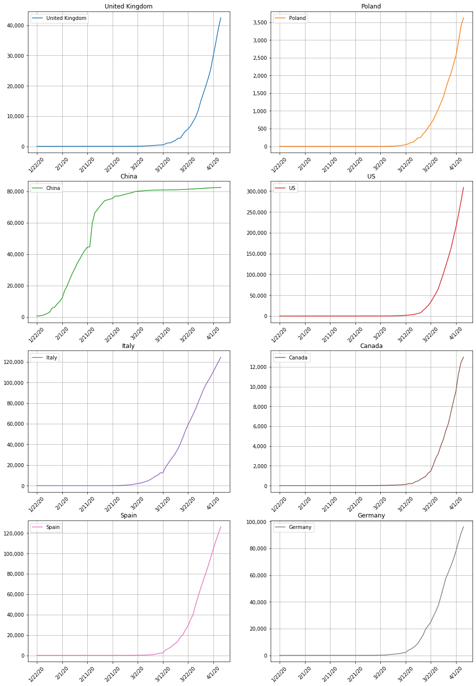
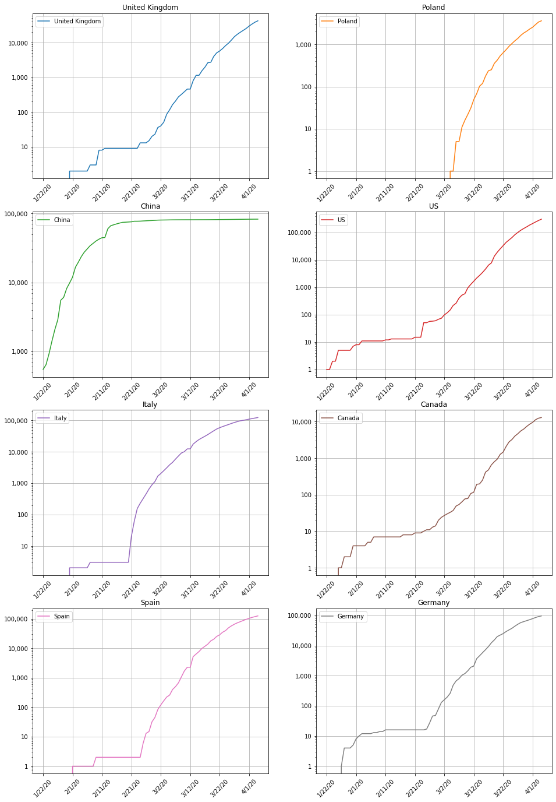

# covid19 global spread analysis
Coronavirus spread analysis

Contact: Robert Nowotniak <<rnowotniak@gmail.com>>

**Last updated:  Apr 5th, 2020**


----

Data sources from John Hopkins University:
* https://github.com/CSSEGISandData/COVID-19
* Global confirmed time series: https://raw.githubusercontent.com/CSSEGISandData/COVID-19/master/csse_covid_19_data/csse_covid_19_time_series/time_series_covid19_confirmed_global.csv
* Global deaths time series: https://raw.githubusercontent.com/CSSEGISandData/COVID-19/master/csse_covid_19_data/csse_covid_19_time_series/time_series_covid19_deaths_global.csv
* Global recovered time series: https://raw.githubusercontent.com/CSSEGISandData/COVID-19/master/csse_covid_19_data/csse_covid_19_time_series/time_series_covid19_recovered_global.csv


Tools to reproduce and to rerun this analysis:

* docker pull jupyter/scipy-notebook
* docker run -p 8888:8888 -v "$PWD:/home/jovyan/work"   --rm jupyter/scipy-notebook


```python
import pandas as pd, numpy as np
import matplotlib.pyplot as plt, matplotlib as mpl
plt.rcParams['figure.figsize'] = [12,8]
```

List of countries to include in the analysis:


```python
COUNTRIES = ['United Kingdom', 'Poland','China','US','Italy','Canada', 'Spain', 'Germany']
```

Load data from John Hopkins University:


```python
CONFIRMED_URL='https://raw.githubusercontent.com/CSSEGISandData/COVID-19/master/csse_covid_19_data/csse_covid_19_time_series/time_series_covid19_confirmed_global.csv'
DEATHS_URL='https://raw.githubusercontent.com/CSSEGISandData/COVID-19/master/csse_covid_19_data/csse_covid_19_time_series/time_series_covid19_deaths_global.csv'
RECOVERED_URL='https://raw.githubusercontent.com/CSSEGISandData/COVID-19/master/csse_covid_19_data/csse_covid_19_time_series/time_series_covid19_recovered_global.csv'
```


```python
confirmed = pd.read_csv(CONFIRMED_URL)
deaths    = pd.read_csv(DEATHS_URL)
recovered = pd.read_csv(RECOVERED_URL)
```


```python
confirmed = confirmed.groupby(by='Country/Region').sum().transpose()[2:].applymap(lambda x: int(x))
deaths    =    deaths.groupby(by='Country/Region').sum().transpose()[2:].applymap(lambda x: int(x))
recovered = recovered.groupby(by='Country/Region').sum().transpose()[2:].applymap(lambda x: int(x))
```


```python
confirmed.tail(10)[COUNTRIES]
```


<div>
<table border="1" class="dataframe">
  <thead>
    <tr style="text-align: right;">
      <th>Country/Region</th>
      <th>United Kingdom</th>
      <th>Poland</th>
      <th>China</th>
      <th>US</th>
      <th>Italy</th>
      <th>Canada</th>
      <th>Spain</th>
      <th>Germany</th>
    </tr>
  </thead>
  <tbody>
    <tr>
      <th>3/26/20</th>
      <td>11812</td>
      <td>1221</td>
      <td>81782</td>
      <td>83836</td>
      <td>80589</td>
      <td>4042</td>
      <td>57786</td>
      <td>43938</td>
    </tr>
    <tr>
      <th>3/27/20</th>
      <td>14745</td>
      <td>1389</td>
      <td>81897</td>
      <td>101657</td>
      <td>86498</td>
      <td>4682</td>
      <td>65719</td>
      <td>50871</td>
    </tr>
    <tr>
      <th>3/28/20</th>
      <td>17312</td>
      <td>1638</td>
      <td>81999</td>
      <td>121478</td>
      <td>92472</td>
      <td>5576</td>
      <td>73235</td>
      <td>57695</td>
    </tr>
    <tr>
      <th>3/29/20</th>
      <td>19780</td>
      <td>1862</td>
      <td>82122</td>
      <td>140886</td>
      <td>97689</td>
      <td>6280</td>
      <td>80110</td>
      <td>62095</td>
    </tr>
    <tr>
      <th>3/30/20</th>
      <td>22453</td>
      <td>2055</td>
      <td>82198</td>
      <td>161807</td>
      <td>101739</td>
      <td>7398</td>
      <td>87956</td>
      <td>66885</td>
    </tr>
    <tr>
      <th>3/31/20</th>
      <td>25481</td>
      <td>2311</td>
      <td>82279</td>
      <td>188172</td>
      <td>105792</td>
      <td>8527</td>
      <td>95923</td>
      <td>71808</td>
    </tr>
    <tr>
      <th>4/1/20</th>
      <td>29865</td>
      <td>2554</td>
      <td>82361</td>
      <td>213372</td>
      <td>110574</td>
      <td>9560</td>
      <td>104118</td>
      <td>77872</td>
    </tr>
    <tr>
      <th>4/2/20</th>
      <td>34173</td>
      <td>2946</td>
      <td>82432</td>
      <td>243453</td>
      <td>115242</td>
      <td>11284</td>
      <td>112065</td>
      <td>84794</td>
    </tr>
    <tr>
      <th>4/3/20</th>
      <td>38689</td>
      <td>3383</td>
      <td>82511</td>
      <td>275586</td>
      <td>119827</td>
      <td>12437</td>
      <td>119199</td>
      <td>91159</td>
    </tr>
    <tr>
      <th>4/4/20</th>
      <td>42477</td>
      <td>3627</td>
      <td>82543</td>
      <td>308850</td>
      <td>124632</td>
      <td>12978</td>
      <td>126168</td>
      <td>96092</td>
    </tr>
  </tbody>
</table>
</div>


## Total confirmed cases (cumulative)


```python
axs = confirmed[COUNTRIES].plot(subplots=True,layout=(4,2),figsize=(16,24),
                               title=COUNTRIES, sharex=False, rot=45, grid=True)
for row in axs:
    for ax in row:
        ax.yaxis.set_major_formatter(mpl.ticker.StrMethodFormatter('{x:,.0f}'))
```





## Total confirmed cases (cumulative)  -  one chart


```python
ax = confirmed[COUNTRIES].plot(grid=True)
ax.yaxis.set_major_formatter(mpl.ticker.StrMethodFormatter('{x:,.0f}'))
plt.title('Total confirmed cases')
```


    Text(0.5, 1.0, 'Total confirmed cases')


```python

```

## Active cases


```python
axs = (confirmed[COUNTRIES] - (recovered[COUNTRIES] + deaths[COUNTRIES])).\
plot(subplots=True,layout=(4,2),figsize=(16,24), title=COUNTRIES, sharex=False, rot=45, grid=True)
for row in axs:
    for ax in row:
        ax.yaxis.set_major_formatter(mpl.ticker.StrMethodFormatter('{x:,.0f}'))
```


## Active cases - one chart


```python
ax = (confirmed[COUNTRIES] - (recovered[COUNTRIES] + deaths[COUNTRIES])).plot(grid=True)
ax.yaxis.set_major_formatter(mpl.ticker.StrMethodFormatter('{x:,.0f}'))
```


```python

```

# Logarithmic scale charts
 

## Total confirmed cases (cumulative) - log scale


```python
axs = confirmed[COUNTRIES].plot(subplots=True,layout=(4,2),figsize=(16,24),
                               title=COUNTRIES, sharex=False, rot=45, grid=True, logy=True)
for row in axs:
    for ax in row:
        ax.yaxis.set_major_formatter(mpl.ticker.StrMethodFormatter('{x:,.0f}'))
```





```python

```

## Total confirmed cases (cumulative)  -  one chart, log scale


```python
ax = confirmed[COUNTRIES].plot(grid=True,logy=True)
ax.yaxis.set_major_formatter(mpl.ticker.StrMethodFormatter('{x:,.0f}'))
plt.title('Total confirmed cases')
```


    Text(0.5, 1.0, 'Total confirmed cases')


```python

```

## Active cases - log scale


```python
axs = (confirmed[COUNTRIES] - (recovered[COUNTRIES] + deaths[COUNTRIES])).\
plot(subplots=True,layout=(4,2),figsize=(16,24), title=COUNTRIES, sharex=False, rot=45, grid=True,logy=True)
for row in axs:
    for ax in row:
        ax.yaxis.set_major_formatter(mpl.ticker.StrMethodFormatter('{x:,.0f}'))
```


## Active cases - one chart, log scale


```python
ax = (confirmed[COUNTRIES] - (recovered[COUNTRIES] + deaths[COUNTRIES])).plot(grid=True,logy=True)
ax.yaxis.set_major_formatter(mpl.ticker.StrMethodFormatter('{x:,.0f}'))
```


